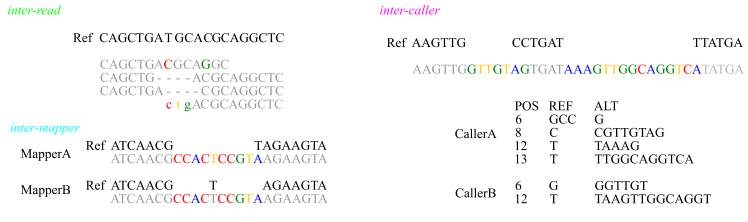

# indelPost
Small insertions/deletions (indels) can be represented differently between mappers and variant callers, or in the flanking sequence context. indelPost harmonizes these inter-mapper, inter-caller, and inter-read alignment ambiguities via realignment and phasing to facilitate post-processing of indel calls. 

