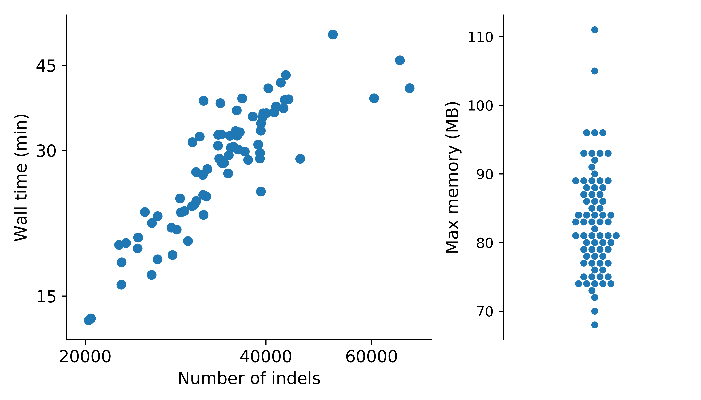

Benchmarking
===============

:class:`~indelpost.VariantAlignment` object construction task for indels called by `GATK4 HaplotypeCaller(4.0.2.1) <https://gatk.broadinstitute.org/hc/en-us/articles/360037059732-HaplotypeCaller>`__ for 75 whole-exome sequencing samples `SJC-DS-1003 <https://platform.stjude.cloud/data/cohorts>`__ on a server with 32-core AMD EPYC 7542 CPU @2.90 GHz. `pandas DataFrame <https://pandas.pydata.org/docs/reference/api/pandas.DataFrame.html>`__ used to store the indel calls. 

.. tip::
    
    For genome-wide indel datasets, consider splitting your data into smaller chunks and analyzing them in parallel.

