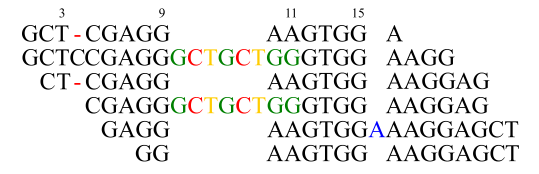

.. _Examples:

Examples
=========

Querying VCF file
-----------------
Below are *NF1* tumor suppressor gene indels regsitered in `COSMIC(v89) <https://cancer.sanger.ac.uk/cosmic>`__ . 
The VCF entries are juxtaposed with the alignments against GRCh38. 

.. image:: nf1.svg
   :width: 600
   :height: 50
   :align: center

|

Using del2 (bottom) as example, query the COSMIC VCF database::
    
    import pysam
    from indelpost import Variant
     
    reference = pysam.FastaFile("/path/to/GRCh38.fa")
    cosmic = pysam.VariantFile("/path/to/cosmic.v89.vcf(.gz)")

    # del2 
    v = Variant("17", 31224665, "CC", "C", reference)
    
Normalization query (default) returns VCF entries that are identical after normalization::
    
    norm_hits = v.query_vcf(cosmic) 
    
    for hit in norm_hits:
        print(hit["INFO"]["CNT"]) #COSMIC counts for del1 and del2 

Locus query returns VCF entries located at the normalized genomic locus::

    locus_hits = v.query_vcf(cosmic, matchby="locus")

    for hit in locus_hits:
        print(hit["INFO"]["CNT"]) #COSMIC counts for del1, del2, ins1, ins2, and in3

Exact query only returns a VCF entry matching without normalization:: 
        
    exact_hit = v.query(cosmic, matchby="exact")
    
    print(exact_hit[0]["INFO"]["CNT"]) #COSMIC count for del2 only
    
    
    
Decomposing complex indels
--------------------------
Reduce a complex indel to a set of simple events:: 

    import pysam
    from indelpost import Variant

    reference = pysam.FastaFile("/path/to/GRCh38.fa")

    v = Variant("chr1", 114299169, "CAGTGA", "TCTCT", reference)

    decomposed = v.decompose_complex_variant() # list of Variant objects
    
    for d in decomposed:

        print(d.chrom, d.pos, d.ref, d.alt)
        
        # chr1 114299168 A AT
        # chr1 114299169 CAG C 
        # chr1 114299173 G C 
        # chr1 114299174 A T 
        

            
|

Tune parameters to obtain a different decomposition::

    decomposed = v.decompose_complex_variant(gap_extension_penalty=3)    

    for d in decomposed:

        print(d.chrom, d.pos, d.ref, d.alt)
        
        # chr1 114299168 AC A
        # chr1 114299170 A T
        # chr1 114299171 G C
        # chr1 114299173 G C
        # chr1 114299174 A T

|

Annotating complex indels from simple indels
-------------------------------------------------------
Complex indel representaions can be obtained from a variant caller output with simple alleles.
Suppose the output VCF file is parsed to "simple_indels.tab"::

    CHROM   POS     REF     ALT
    1       123     A       ATC
    1       4567    GTCC    G
    1       8901    TGA     T
    ...

Annotate complex indels for the table::
    
    import pysam
    import pandas as pd
    from indelpost import Variant, VariantAlignment

    reference = pysam.FastaFile("/path/to/reference.fa")
    bam = pyasm.AlignmetnFile("/path/to/bam_used_for_variant_calling.bam")

    def annot_complex_indel(row):
        v = Variant(row["CHROM"], row["POS"], row["REF"], row["ALT"], reference)
        valn = VariantAlignment(v, bam)
        
        v_cplx = v.phase(how="complex") # v_cplx may be simple 

        return v_cplx.pos, v_cplx.ref. v_cplx.alt
        
    df = pd.read_csv("simple_indels.tab", sep="\t")
    
    df["COMPLEX_POS"], df["COMPLEX_REF"], df["COMPLEX_ALT"] = zip(*df.apply(annot_complex_indel, axis=1))                 
    
    ...

Integrating indel call sets
-----------------------------------
In the pileup, two variant callers reported different sets of indels to integrate.

   
|

:: 

   Caller A                      Caller B 
   CHROM POS REF ALT             CHROM POS REF ALT
   N     3   TC  C               N     3   TC  C
   N     9   GAA G               N     9   G   GGCTGCT 
   N     11  A   AGCTGCTGG       N     15  G   GA

Prepare phased indel calls::

    reference = pysam.FastaFile("/path/to/reference.fa")
    bam = pysam.AlignmentFile("/path/to/thisdata.bam")
     
    v_a1_phased = VariantAlignment(Variant("N", 3, "TC", "C", reference), bam).phase()
    v_a2_phased = VariantAlignment(Variant("N", 9, "GAA", "G", reference), bam).phase()
    ...
    v_b3_phased = VariantAlignment(Variant("N", 15, "G", "GA", reference), bam).phase()

        
Use `set <https://docs.python.org/3/tutorial/datastructures.html#sets>`__ to integrate them::
    
    call_set_A = {v_a1_phased, v_a2_phased, v_a3_phased}
    call_set_B = {v_b1_phased, v_b2_phased, v_b3_phased}

    union = call_set_A | call_set_B

    for v in union:
        print(v.chrom, v.pos, v.ref, v.alt)
        
        # N, 3, TC, C
        # N, 10, AA, GCTGCTGG
        # N, 15, GA, A

    
    consensus = call_set_A & call_set_B

    for v in consensus:
        print(v.chrom, v.pos, v.ref, v.alt)

        # N, 3, TC, C
        # N, 10, AA, GCTGCTGG
