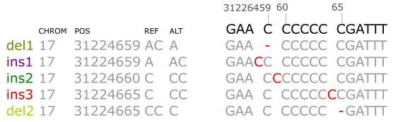

.. _Examples:

Examples
=========

Querying VCF file
-----------------
Below are *NF1* tumor suppressor gene indels regsitered in `COSMIC(v89) <https://cancer.sanger.ac.uk/cosmic>`__ . 
The VCF entries are juxtaposed with the alignments against GRCh38. 

|

To query the COSMIC VCF database for these indels::
    
    import pysam
    from indelpost import Variant
     
    reference = pysam.FastaFile("/path/to/GRCh38.fa")
    cosmic = pysam.VariantFile("/path/to/cosmic.v89.vcf(.gz)")

    #Suppose your input is del2 (the last row)
    v = Variant("17", 31224665, "CC", "C", reference)
    
    #query by normalization (default)
    norm_hits = v.query_vcf(cosmic) 
    
    for hit in norm_hits:
        print(hit["INFO"]["CNT"]) #COSMIC counts for del1 and del2 

    #query for normalized genomic coordinate
    locus_hits = v.query_vcf(cosmic, matchby="locus")

    for hit in locus_hits:
        print(hit["INFO"]["CNT"]) #COSMIC counts for del1, del2, ins1, ins2, and in3
        
    #exact match (no normalization)
    exact_hit = v.query(cosmic, matchby="exact")
    
    print(exact_hit[0]["INFO"]["CNT"]) #COSMIC count for del2 only 
